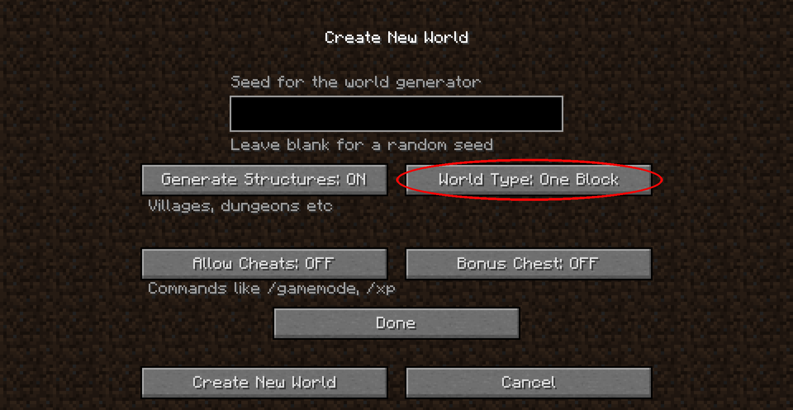
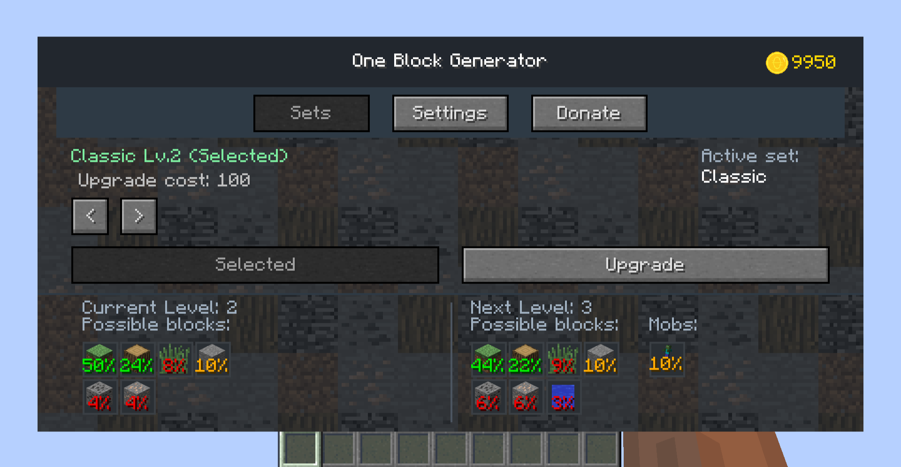
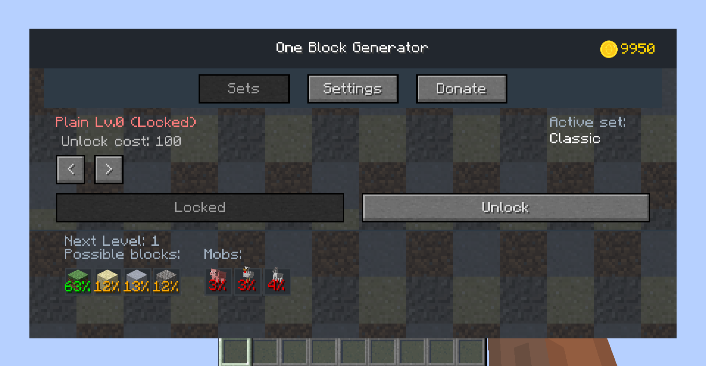
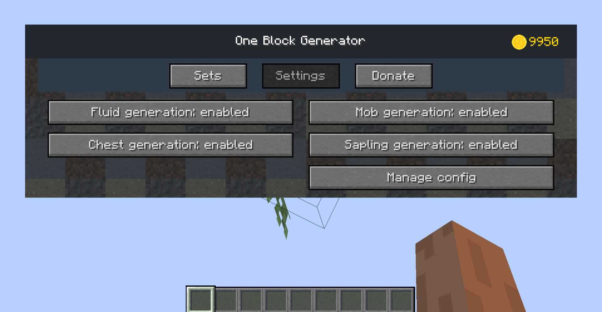
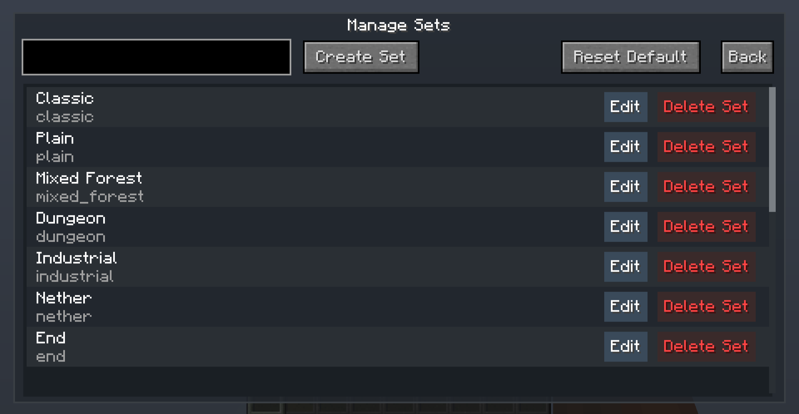
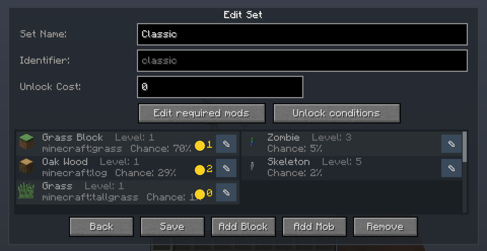
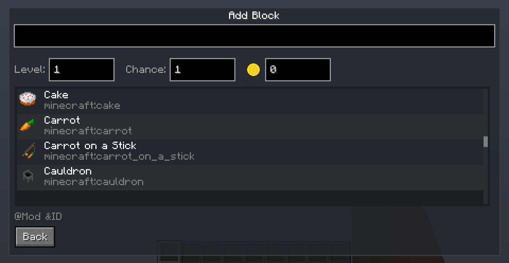
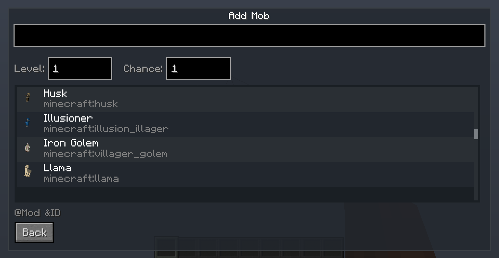
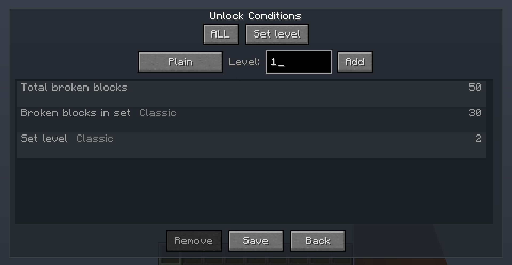

<h1>Language</h1>
[English|<a href="./README_RUS.MD">Русский</a>]
<h1>Description</h1> 
This mod will give you a unique survival experience in a world where there is only one block. It adds a <b>new type of "One Block" world</b> that will regenerate whenever you break it. By clicking on the generated block, you will open the generator menu, where you can select a set, open new ones and improve the already opened sets. The mod also adds a balance, which you replenish by destroying blocks. 
 
The mod is compatible with other mods, and it already has basic support:
<ul>
    <li>Industrial Craft 2</li>
    <li>Draconic Evolution</li>
    <li>ThaumCraft</li>
    <li>Botania</li>
    <li>Applied Energistics 2</li>
    <li>Industrial Upgrade</li>
    <li>Thermal Foundation</li>
    <li>Tinker's Construct</li>
    <li>Extra Utils 2</li>
    <li>Forestry</li>
    <li>Astral Sorcery</li>
    <li>DivineRPG</li>
    <li>Farmer's Delight Legacy</li>
    <li>Pam's HarvestCraft</li>
</ul>
<u>If desired</u>, you can edit the <i>configuration of the sets</i>.
<h2>Where the mod is distributed</h2>
<ul>
    <li><a href="https://github.com/XZSt4nce/oneblockultima/releases/">GitHub</a>
    <li><a href="https://www.curseforge.com/minecraft/mc-mods/oneblockultima">Curse Forge</a>
    <li><a href="https://tlmods.org/ru/mods/one-block-ultima/">TLauncher</a>
    <li><a href="https://minecraft-inside.ru/194280/">Minecraft Inside</a>
</li>
</ul>

<h1>How to download mod</h1>
<ol>
    <li>Download and install <a href="https://files.minecraftforge.net/net/minecraftforge/forge">Minecraft Forge</a></li>
    <li>Download mod</li>
    <li>Without unpacking, place on the path C:\Users\USER_NAME\AppData\Roaming\.minecraft\mods</li>
    <li>Done</li>
</ol>

<h1>Screenshots</h1>

<h1>For developers</h1>
The latest versions of the mod for specific versions of Minecraft are separated into separate branches

Branches:
<ul>
    <li><a href="https://github.com/XZSt4nce/OneBlockUltima/tree/forge_1.7.10">Forge 1.7.10</a></li>
    <li><a href="https://github.com/XZSt4nce/OneBlockUltima/tree/forge_1.12.x">Forge 1.12.2</a></li>
</ul>
