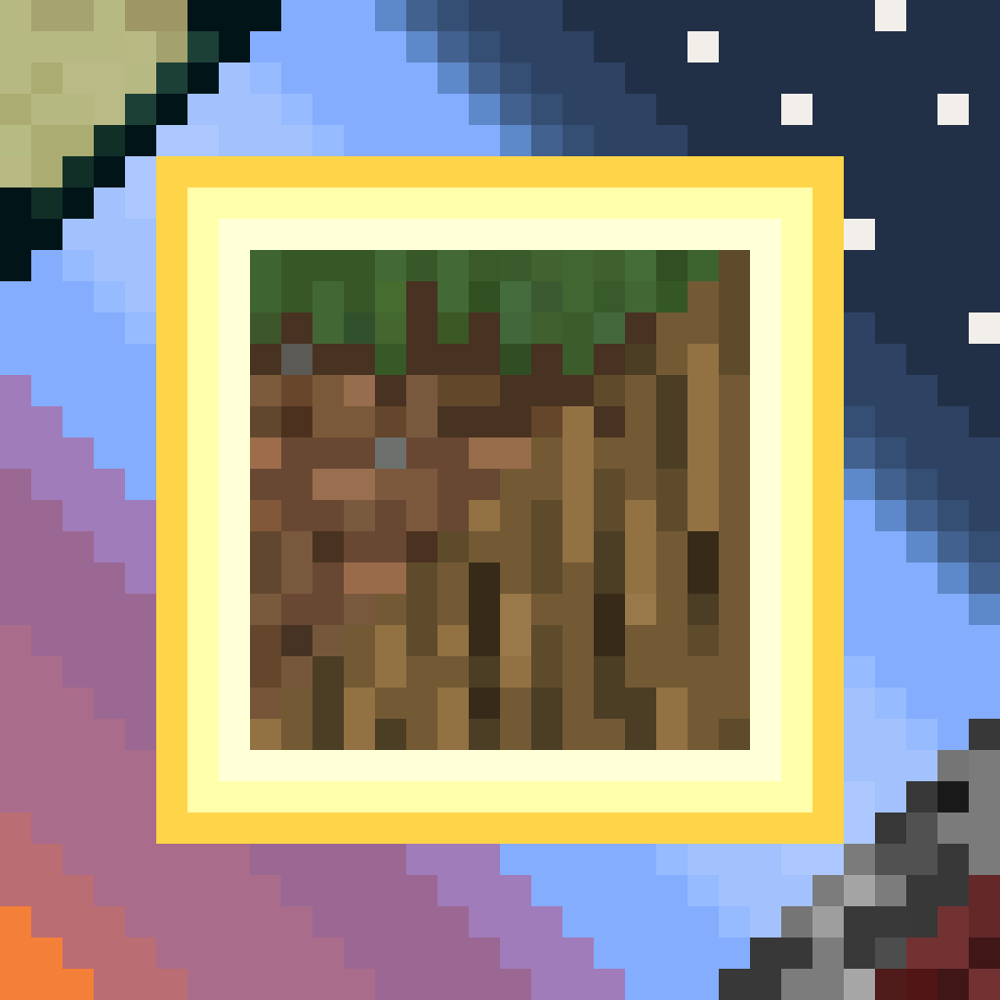
<h1>Язык</h1>
[<a href="./README.MD">English</a>|Русский]
<h1>Описание</h1> 
Данный мод подарит вам уникальный опыт выживания в мире, в котором есть всего лишь один блок. Он добавляет <b>новый тип мира "Один блок"</b>, который будет перегенерироваться всякий раз, когда вы его ломаете. Нажав на ПКМ на генерируемый блок, вы откроете меню генератора, где сможете выбрать набор, открыть новые и улучшить уже открытые наборы. Также мод добавляет баланс, который вы пополняете за разрушение блоков.
 
 
Мод совместим с другими модами и в нём уже есть базовая поддержка:
<ul>
    <li>Industrial Craft 2</li>
    <li>Draconic Evolution</li>
    <li>ThaumCraft</li>
    <li>Botania</li>
    <li>Applied Energistics 2</li>
    <li>Industrial Upgrade</li>
    <li>Thermal Foundation</li>
    <li>Tinker's Construct</li>
    <li>Extra Utils 2</li>
    <li>Forestry</li>
    <li>Astral Sorcery</li>
    <li>DivineRPG</li>
    <li>Farmer's Delight Legacy</li>
    <li>Pam's HarvestCraft</li>
</ul>
<u>При желании</u>, можно редактировать <i>конфигурацию наборов</i>

<h2>Где распространяется мод</h2>
<ul>
    <li><a href="https://github.com/XZSt4nce/oneblockultima/releases/">GitHub</a>
    <li><a href="https://www.curseforge.com/minecraft/mc-mods/oneblockultima">Curse Forge</a>
    <li><a href="https://tlmods.org/ru/mods/one-block-ultima/">TLauncher</a>
    <li><a href="https://minecraft-inside.ru/194280/">Minecraft Inside</a>
</li>
</ul>

<h1>Как скачать мод</h1>
<ol>
    <li>Скачай и установи <a href="https://files.minecraftforge.net/net/minecraftforge/forge">Minecraft Forge</a></li>
    <li>Скачай мод</li>
    <li>Не распаковывая поместите по пути C:\Users\ИМЯ_ПОЛЬЗОВАТЕЛЯ\AppData\Roaming\.minecraft\mods</li>
    <li>Готово</li>
</ol>

<h1>Скриншоты</h1>
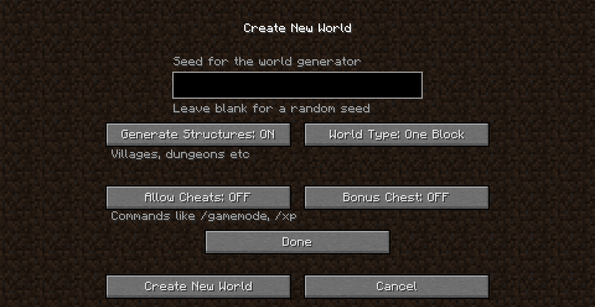
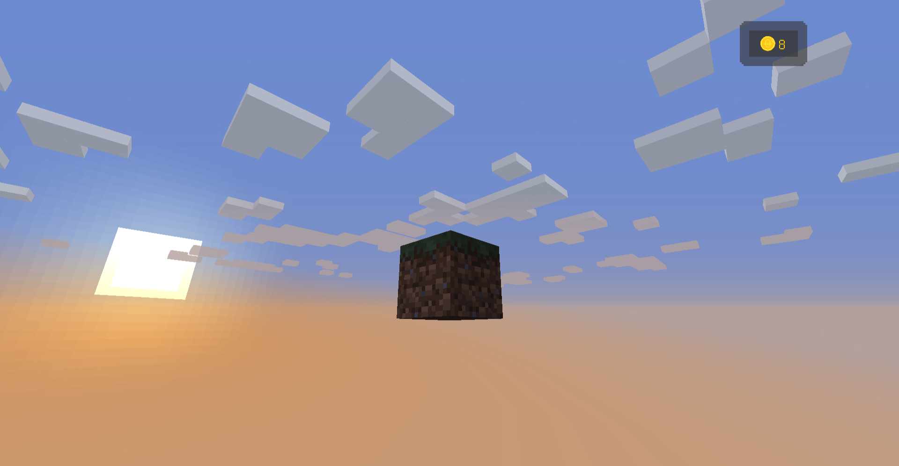
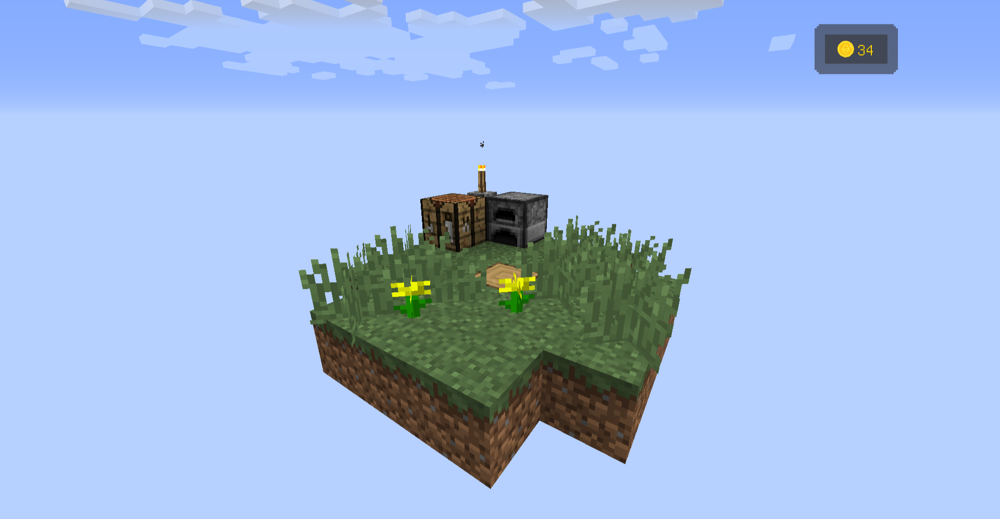
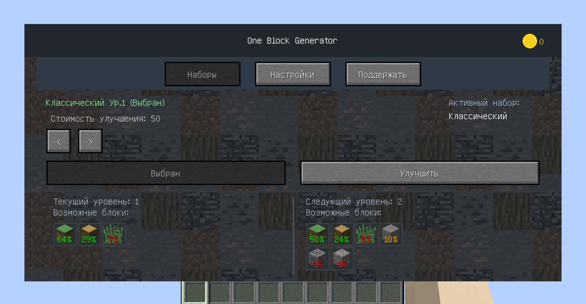
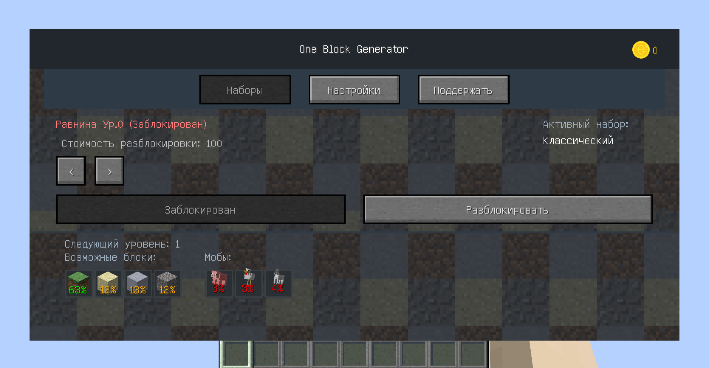
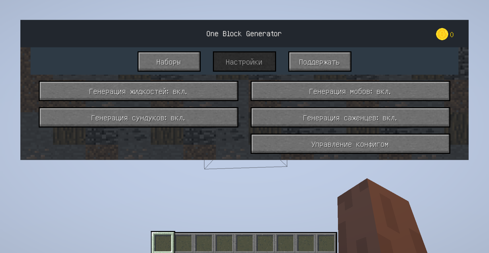
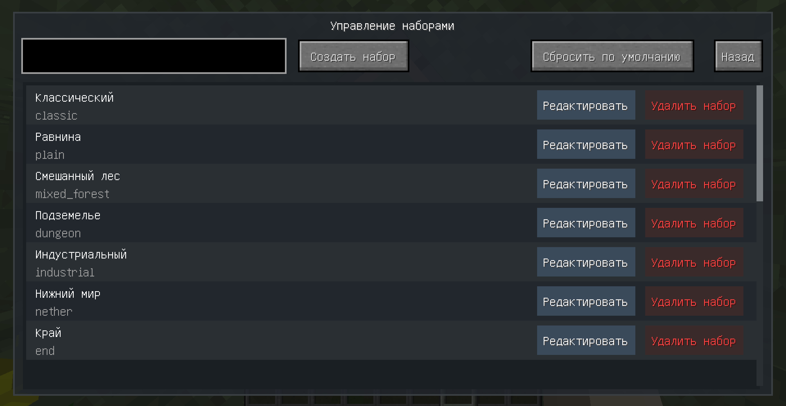
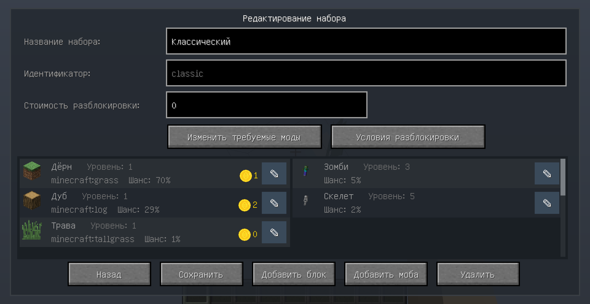
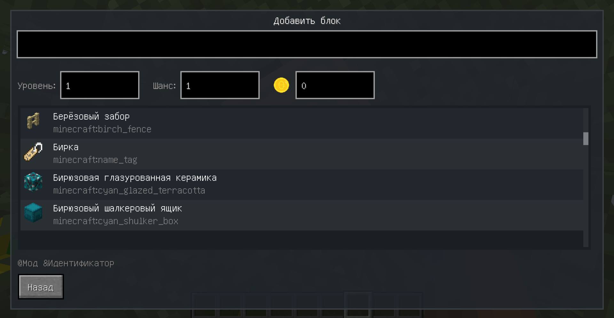
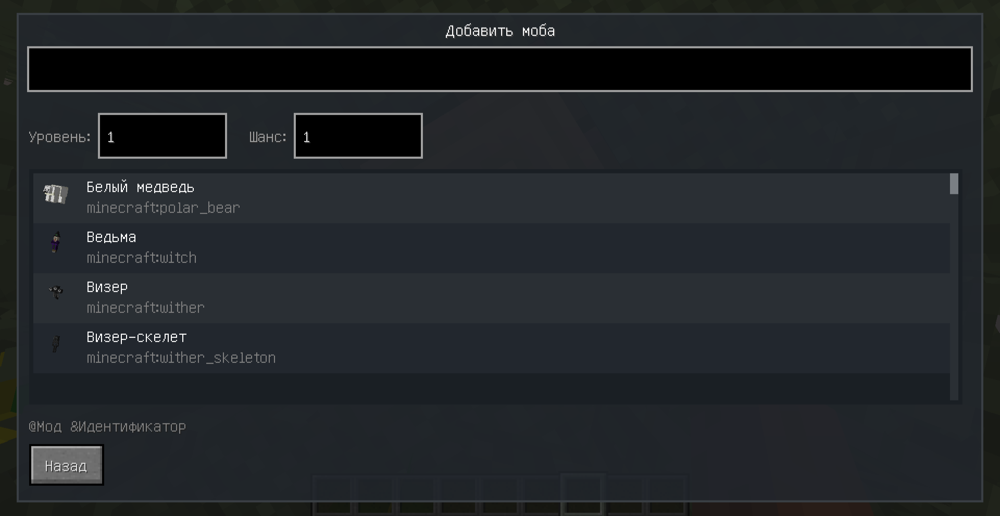
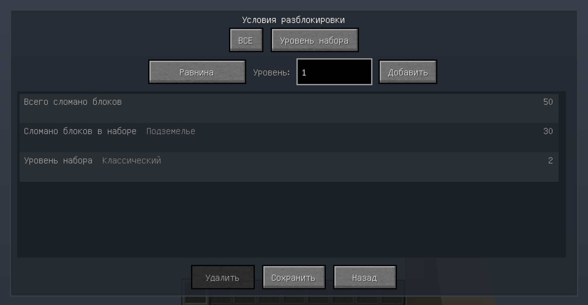

<h1>Для разработчиков</h1>
Последние версии мода для конкретных версий майнкрафта выделены в отдельные ветки

Ветки:
<ul>
    <li><a href="https://github.com/XZSt4nce/OneBlockUltima/tree/forge_1.7.10">Forge 1.7.10</a></li>
    <li><a href="https://github.com/XZSt4nce/OneBlockUltima/tree/forge_1.12.x">Forge 1.12.x</a></li>
</ul>
